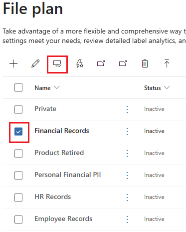

---
lab:
  task: Create retention labels
  exercise: Exercise 2 - Create retention labels
---

## Locatários do WWL – Termos de uso

Se você estiver recebendo um locatário como parte de uma entrega de treinamento com instrutor, observe que o locatário é disponibilizado com a finalidade de dar suporte aos laboratórios práticos no treinamento com instrutor.

Os locatários não devem ser compartilhados ou usados para fins fora dos laboratórios práticos. O locatário usado neste curso é um locatário de avaliação e não pode ser usado ou acessado após o fim da aula e não está qualificado para extensão.

Os locatários não podem ser convertidos em uma assinatura paga. Os locatários obtidos como parte deste curso permanecem a propriedade da Microsoft Corporation e reservamos o direito de obter acesso e a qualquer momento.

# Exercício 2 – Tarefas de qualificação

Sua tarefa é criar e gerenciar rótulos de retenção que atendam aos critérios exigidos:

- **Criar rótulos de retenção**: configure rótulos de retenção para diferentes tipos de documentos e emails.
- **Publicar rótulos de retenção**: disponibilize os rótulos de retenção para os usuários aplicarem.
- **Aplicar rótulos de retenção automaticamente**: configure os rótulos de retenção para serem aplicados automaticamente com base em condições específicas.

## Tarefa 1 – Criar rótulos de retenção

Nesta tarefa, você criará rótulos de retenção que podem ser atribuídos a documentos e emails.

1. No Microsoft Edge, navegue até o portal do Microsoft Purview, `https://purview.microsoft.com`, e faça logon.
1. Selecione **Soluções** > **Gerenciamento de registros.**
1. No painel de navegação à esquerda, selecione **Plano de arquivo**.
1. Na página **Plano de arquivo**, clique em **+ Criar um rótulo**.
1. Na página de entrada **Nomear rótulo de retenção**:

    - **Nome**: `Financial Records`
    - **Descrição para usuários**: `Assign this label to financial documents to ensure they are retained for the required period.`
    - **Descrição para administradores**: `Financial records with retention period.`
1. Selecione **Avançar**.
1. Na página **Definir descritores de plano de arquivo para este rótulo**, clique em **Avançar**.
1. Na página **Definir configurações de rótulo**, escolha **Reter itens para sempre ou por um período específico** e clique em **Avançar**.

1. Na entrada **Definir o período**:

    - **Quanto tempo dura o período?**: sete anos
    - **Quando o período deve começar?**: quando os itens foram criados
1. Selecione **Avançar**.
1. Na página **Escolher o que acontece durante o período de retenção**, selecione **Reter itens mesmo se os usuários excluírem** e clique em **Avançar**.
1. Na página **Escolher o que acontece após o período de retenção**, selecione **Desativar configurações de retenção** e clique em **Avançar**.
1. Na página **Revisar e concluir**, selecione **Criar rótulo**.
1. Na página **Seu rótulo de retenção foi criado**, selecione **Não fazer nada** e selecione **Concluído**. O rótulo será publicado posteriormente no exercício.
1. De volta à página **Plano de arquivo**, selecione **+ Criar um rótulo** para criar outro rótulo de retenção.
1. Na página **Nomear rótulo de retenção**, insira:

    - **Nome**: `HR Records`
    - **Descrição para usuários**: `This label is auto-applied to HR records with a retention period of five years.`
    - **Descrição para administradores**: `Auto-applied retention label for HR records.`
1. Selecione **Avançar**.
1. Na página **Definir descritores de plano de arquivo para este rótulo**, clique em **Avançar**.
1. Na página **Definir configurações de rótulo**, escolha **Reter itens para sempre ou por um período específico** e clique em **Avançar**.
1. Na entrada **Definir o período**:

    - **Quanto tempo dura o período?**: cinco anos
    - **Quando o período deve começar?**: quando os itens foram criados
1. Selecione **Avançar**.
1. Em **Escolher o que acontece durante o período de retenção**, selecione **Reter itens mesmo que os usuários excluam** e clique em **Avançar**.
1. Na página **Escolher o que acontece após o período de retenção**, selecione **Desativar configurações de retenção** e clique em **Avançar**.
1. Na página **Revisar e concluir**, selecione **Criar rótulo**.
1. Na página **Seu rótulo de retenção foi criado**, selecione **Não fazer nada** e, em seguida, **Concluído**.

Você criou rótulos de retenção para registros financeiros com um período de retenção de sete anos e registros de RH com um período de retenção de cinco anos.

## Tarefa 2 – Publicar rótulos de retenção

Seguindo a Tarefa 1, você publicará os rótulos de retenção para que eles estejam disponíveis para os usuários aplicarem a documentos em emails do Exchange e documentos do SharePoint.

1. Você ainda deve estar na página **Plano de arquivo** no portal do Microsoft Purview.
1. Selecione a marca de seleção ao lado do rótulo de retenção de **Registros financeiros** e, em seguida, clique no botão **Publicar rótulos**.

    >

1. Na página **Escolher rótulos para publicar**, o rótulo de retenção **Registros Financeiros** será exibido.
1. Selecione **Avançar**.
1. Na página **Escopo da política**, clique em **Avançar**.
1. Na página **Escolher o tipo de política de retenção para criar**, selecione **Estática ** e clique em **Avançar**.
1. Na página **Escolher onde publicar rótulos**, selecione **Deixar que eu escolha locais específicos** e habilite:

   - Caixas de correio do Exchange
   - Sites clássicos e de comunicação do SharePoint
   - Contas do OneDrive

1. Verifique se as caixas de correio e sites do Grupo do Microsoft 365 estão definidos como **Desativados** e clique em **Avançar**.
1. Na página **Nomear política**, insira:

   - Nome: `Financial Records Retention Label`
   - Descrição: `Retention label for financial records with a seven-year retention period.`
1. Selecione **Avançar**.
1. Na página **Concluir**, clique em **Enviar**.
1. Na página **Seu rótulo de retenção foi publicado,** clique em **Concluído**.

Você publicou o rótulo de retenção para registros financeiros.

## Tarefa 3 – Publicar rótulos de retenção de aplicação automática

Seguindo a Tarefa 1, agora você aplicará automaticamente o rótulo de retenção de Registros de RH para que as informações sejam retidas.

1. Você ainda deve estar em **Gerenciamento de Registros** no portal do Microsoft Purview.

   Se não estiver, no Microsoft Edge, navegue até o portal do Microsoft Purview, `https://purview.microsoft.com`, e faça logon. Selecione **Soluções** > **Gerenciamento de registros.**

1. No painel de navegação à esquerda, expanda **Políticas** e selecione **Políticas de rótulo**.
1. Selecione **Aplicar automaticamente um rótulo** para iniciar a configuração **Criar política de rotulagem automática**.
1. Na página **Introdução**, em **Nome** e **Descrição**, insira as seguintes informações:

   - **Nome**: `HR Records auto-applied`
   - **Descrição**: `HR Records auto-applied retention label, with a retention period of five years for all locations.`
1. Selecione **Avançar**.
1. Na página **Escolher o tipo de conteúdo ao qual você deseja aplicar este rótulo**, selecione **Aplicar rótulo ao conteúdo que contém informações confidenciais** e selecione **Avançar**.
1. Na página **Conteúdo que contém informações confidenciais**, selecione a categoria **Avançado** e o **regulamento Aprimorado de Dados de PII (Informações de Identificação Pessoal) dos EUA** e clique em **Avançar**.

    >

1. Na página **Definir conteúdo que contém informações confidenciais**, deixe os padrões selecionados e clique em **Avançar**.
1. Na página **Escopo da política**, clique em **Avançar**.
1. Na página **Escolher o tipo de política de retenção para criar**, selecione **Estática ** e clique em **Avançar**.
1. Na página **Escolher locais para aplicar a política**, ative as opções para:

   - Caixas de correio do Exchange
   - Sites clássicos e de comunicação do SharePoint
   - Contas do OneDrive
   - Caixas de correio do Grupo do Microsoft 365 e sites

1. Selecione **Avançar**.
1. Na página **Escolher um rótulo para aplicar automaticamente**, selecione **Adicionar rótulo**.
1. Na página de submenu **Escolher um rótulo** à direita, marque a caixa de seleção ao lado de **Registros de RH** e clique em **Adicionar**.
1. De volta à página **Escolher um rótulo para aplicar automaticamente**, clique em **Avançar**.
1. Em **Decidir se deseja testar ou executar a política**, selecione **Ativar política** e selecione **Avançar**.
1. Na página **Revisar e concluir**, clique em **Enviar**. Quando a política for criada, clique em **Concluído**.

Você publicou um rótulo de retenção com aplicação automática. Nos próximos sete dias, todos os documentos relevantes serão automaticamente rotulados com o rótulo publicado.
