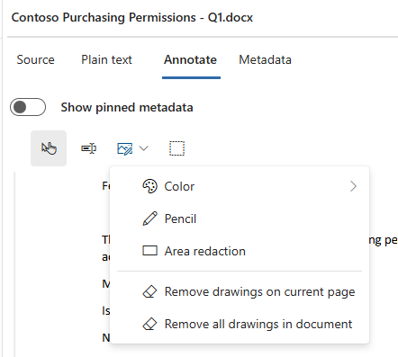

---
lab:
  task: Case investigation with eDiscovery
  exercise: Exercise 3 - Case investigation with eDiscovery
---

## Locatários do WWL – Termos de uso

Se você estiver recebendo um locatário como parte de uma entrega de treinamento com instrutor, observe que o locatário é disponibilizado com a finalidade de dar suporte aos laboratórios práticos no treinamento com instrutor.

Os locatários não devem ser compartilhados ou usados para fins fora dos laboratórios práticos. O locatário usado neste curso é um locatário de avaliação e não pode ser usado ou acessado após o fim da aula e não está qualificado para extensão.

Os locatários não podem ser convertidos em uma assinatura paga. Os locatários obtidos como parte deste curso permanecem a propriedade da Microsoft Corporation e reservamos o direito de obter acesso e a qualquer momento.

# Exercício 3 – Tarefas de qualificação

A Contoso suspeita que dados confidenciais de pagamento, incluindo números de cartão de crédito e conta, foram manipulados incorretamente ou vazados. Como pesquisador, seu trabalho é usar a Descoberta Eletrônica do Microsoft Purview para criar um caso, pesquisar em fontes de dados, identificar conteúdo confidencial e aplicar restrições antes de produzir os resultados para conformidade ou revisão jurídica.

Sua tarefa é criar e gerenciar casos de Descoberta Eletrônica que atendam aos critérios de investigação:

- **Crie um caso de Descoberta Eletrônica**: Crie um caso para gerenciar a investigação de dados de pagamento.
- **Execute uma pesquisa de Descoberta Eletrônica**: Pesquise em fontes de dados para identificar arquivos que possam conter informações de cartão de pagamento ou conta.
- **Adicione itens a um conjunto de revisão**: Envie os resultados da pesquisa para um conjunto de revisão para uma análise mais profunda.
- **Marque itens para análise**: Aplique marcas de relevância e restrição para organizar documentos para o caso.
- **Aplique restrições**: Use ferramentas de anotação para mascarar detalhes confidenciais, como números de cartão e conta.
- **Exporte os resultados**: Exporte os itens restritos e marcados, juntamente com um relatório do item, para produção.

   > **Observação**: este laboratório pressupõe acesso a um locatário do M365 E5 com dados a serem explorados para conduzir uma investigação. Você ainda podrá este exercício sem os dados, mas as coletas e os conjuntos de revisão não produzirão resultados.

## Tarefa 1 – Conceder permissões para Descoberta Eletrônica

Para exportar arquivos, você precisa de permissões específicas devido ao acesso direto que esta opção concede aos arquivos do usuário.

1. No Microsoft Edge, navegue até o portal do Microsoft Purview, `https://purview.microsoft.com`, e faça logon.

1. No painel de navegação esquerdo, selecione **Configurações**.

1. No painel de navegação à esquerda, expanda **Funções e escopos** e selecione **Grupos de funções**.

1. Na página **Grupos de funções para Soluções do Microsoft Purview**, selecione **Gerenciador de Descoberta Eletrônica**.

1. Na página de submenu **Gerenciador de Descoberta Eletrônica** à direita, selecione **Editar**.

1. Na página **Gerenciar o Administrador de Descoberta Eletrônica**, selecione **Escolher usuários**.

1. Na página de submenu **Escolher usuários** à direita, selecione o usuário que você usará para realizar a investigação de Descoberta Eletrônica nas próximas etapas e clique em **Selecionar**.

    >**Observação**: certifique-se de selecionar o usuário que revisará os dados e exportará os resultados da pesquisa.

1. De volta à página **Gerenciar Gerenciador de Descoberta Eletrônica**, selecione **Avançar**.

1. Na página **Gerenciar o Administrador de Descoberta Eletrônica**, selecione **Avançar**.

1. Na página **Revisar o grupo de funções e concluir**, clique em **Salvar** para adicionar seu usuário ao grupo de funções do Gerenciador de Descoberta Eletrônica.

1. Depois de adicionar os usuários , selecione **Concluído** na página **Você atualizou o grupo de funções**.

Você concedeu a permissão do Gerenciador de Descoberta Eletrônica.

## Tarefa 2 – Criar um caso de Descoberta Eletrônica

Nesta tarefa, você criará um caso de Descoberta Eletrônica para gerenciar a investigação de dados de pagamento.

1. No Microsoft Purview, selecione **Soluções** > **Descoberta Eletrônica**.

1. Na página **Casos**, selecione **Criar caso**.

1. Na janela da caixa de diálogo **Novo caso**, digite:

   - **Nome do caso**: `Payment Data Leak Investigation`
   - **Descrição do caso**: `Investigation into potential exposure of payment card and account data at Contoso.`

1. Selecione **Criar**.

   Depois que o caso for criado, você será levado diretamente ao novo caso.

Você criou com êxito um caso de Descoberta Eletrônica chamado _Investigação de Vazamento de Dados de Pagamento_.

## Tarefa 3 – Criar uma pesquisa de Descoberta Eletrônica

Nesta tarefa, você criará uma pesquisa para localizar emails e documentos que fazem referência a dados de pagamento confidenciais.

1. Selecione **Criar uma pesquisa**.

1. Na janela da caixa de diálogo **Nova pesquisa**, insira:

   - **Nome da pesquisa**: `Payment Data Exposure Search`
   - **Descrição da pesquisa**: `Find emails and documents that reference credit cards, debit cards, or account numbers.`

1. Selecione **Criar**.

1. Na página **Pesquisa de Exposição de Dados de Pagamento**, selecione **Adicionar fontes**.

1. Na página **Pesquisar de origem**, **filtre** suas fontes para **Somente grupos**.

1. Selecione **Adicionar fontes em todo o locatário** e deixe as caixas de seleção selecionadas para **Todas as pessoas e grupos** e **Todas as pastas públicas**.

1. Selecione **Salvar**.

1. De volta à página **Pesquisa de Exposição de Dados de Pagamento**, no **Construtor de condições**, adicione condições:

   - Na primeira caixa, defina **Palavras-chave Iguais a** e, em seguida, digite `credit card`.
   - Na segunda caixa, digite `debit card`.
   - Na terceira caixa, digite `account number`.

   > **Observação**: As condições são tratadas como OR, portanto, a pesquisa retorna itens que incluem cartão de crédito, cartão de débito ou número da conta.

1. Selecione **Executar consulta**.

1. Na página **Escolher resultados da pesquisa**, selecione **Estatísticas** e, em seguida, marque **Incluir relatório de palavras-chave da consulta**.

1. Selecione **Executar consulta** para iniciar a pesquisa.

   > **Observação**: Esse processo pode levar cerca de 5 minutos para gerar resultados.

1. Quando a pesquisa for concluída, examine os resultados na guia **Estatísticas**. Examine as contagens de itens, o volume de dados e as ocorrências de palavras-chave.

1. Alterne para a guia **Amostra**. Selecione **Gerar resultados de amostra**.

1. Na página **Gerar exibição de exemplo**, deixe os padrões selecionados e selecione **Executar Consulta**.

   > **Observação**: Esse processo pode levar cerca de 5 minutos para gerar resultados.

1. Depois que a consulta for concluída, examine os resultados.

Você executou a pesquisa com êxito e revisou os resultados usando as exibições Estatísticas e Amostras.

## Tarefa 4 – Adicionar a pesquisa a um conjunto de revisão

Nesta tarefa, você enviará os resultados da pesquisa para um conjunto de revisão para que eles possam ser analisados mais adiante.

1. Na página **Pesquisa de Exposição de Dados de Pagamento**, selecione **Adicionar ao conjunto de revisão**.

1. No submenu **Adicionar ao conjunto de revisão**, selecione **Adicionar ao novo conjunto de revisão**.

   - Insira um nome: `Payment Data Review Set`.

1. Em **Selecionar itens para incluir**, mantenha **os itens indexados que correspondem à consulta de pesquisa selecionada**.

1. Em **Selecionar itens em listas e anexos**, selecione **Listar anexos** para que os arquivos anexados sejam incluídos no conjunto de revisão.

1. Deixe todas as outras opções em seus padrões e selecione **Adicionar ao conjunto de revisão**.

   > **Observação**: Esse processo pode levar cerca de 5 minutos para gerar resultados.

Você criou com êxito o **Conjunto de Revisão de Dados de Pagamento** e adicionou os resultados da pesquisa a ele.

## Tarefa 5 – Examinar e marcar itens

Nesta tarefa, você filtra os itens do conjunto de revisão e aplica marcas para organizá-los para a investigação.

1. Na página **Conjunto de Revisão de Dados de Pagamento**, selecione **Consulta** e configure:

   - Primeira lista suspensa: **Palavras-chave**
   - Operador: **É igual a qualquer um dos**
   - Inserir palavras-chave:

     - `Visa`
     - `Master Card`
   - Selecione **+ Adicionar condições**.
   - Adicionar condição:

     - Campo: **Classe do arquivo**
     - Operador: **É igual a qualquer um dos**
     - Valor: `Document`
   - Selecione **Executar consulta**.

1. Selecione **Salvar** para salvar essa consulta de pesquisa. No campo Nome do filtro, insira `Payment data docs`.

1. Na barra de comandos, selecione **Arquivos de marcação**.

1. No submenu de **Arquivos de marcação**, selecione **Criar/editar marcas**.

1. Na página **Gerenciar marcas**, configure:

   - **Nome do grupo de marcas**: `Relevance`

     - **Nome da marca**: `Relevant`
     - Selecione **Adicionar marca** e, em seguida, adicione `Not relevant`
   - Selecione **Adicionar grupo de marcas**.
   - **Nome do grupo de marcas**: `Review status`
     - **Nome da marca**: `Needs redaction`

1. Selecione **Salvar**, em seguida, **Fechar**.

1. No submenu de **Arquivos de marcação**, marque o primeiro item como **Relevante** e o segundo item como **Não relevante**.

1. No conjunto de revisão, localize **Permissões de Compra da Contoso – T1.docx** de **Irvin S** de **2 de agosto de 2019**.

1. Selecione o item e marque-o **Precisa de restrição**.

1. Selecione **Fechar** para fechar o submenu de **Arquivos de marcação**.

Você marcou documentos como relevantes, não relevantes e necessita restrição.

## Tarefa 6 – Aplicar restrições

Nesta tarefa, você vai restringir informações confidenciais de um documento em seu conjunto de revisão.

1. No **Conjunto de Revisão de Dados de Pagamento**, selecione **Permissões de Compra da Contoso – T1.docx** de **Irvin S** datado de **2 de agosto de 2019** para abrir o visualizador de documentos.

1. Na barra de ferramentas do visualizador, selecione **Anotar**.

1. Nas ferramentas de anotação, selecione a lista suspensa para **Desenho** e, em seguida, selecione **Restrição de área**.

    >

1. Com o cursor, desenhe uma caixa em torno das informações confidenciais no arquivo, como:

   - Número do cartão Visa
   - Número do MasterCard
   - Número da conta bancária

1. Repita conforme necessário até que todos os dados confidenciais estejam cobertos.

1. Feche o visualizador de documentos.

1. De volta à página **Conjunto de Revisão de Dados de Pagamento**, com o arquivo **Permissões de Compra da Contoso – T1.docx** selecionado, escolha **Ações** > **Enviar Redações para PDF**.

   > **Observação**: A confirmação das restrições salva um PDF com as restrições no conjunto de revisão, mantendo o arquivo original inalterado.

Você aplicou restrições com êxito e as enviou para uma cópia em PDF restrita.

## Tarefa 7 – Exportar resultados

Nesta tarefa, você exportará os itens com restrições e marcados do conjunto de revisão para produção.

1. No **Conjunto de Revisão de Dados de Pagamento**, marque as caixas de seleção ao lado dos itens que você deseja exportar.

   > Inclua as o documento **Permissões de Compra da Contoso – T1.docx** que você protegeu.

1. Na barra de comandos, selecione **Ações** > **Exportar**.

1. No submenu **Exportar**, configure:

   - **Nome da exportação**: `PaymentData_Export_2025`
   - **Descrição**: `Export of review set items with redacted versions for Payment Data Leak Investigation.`

1. Em **Selecionar itens para incluir em sua exportação**:

   - Escolha **Somente documentos selecionados**.
   - Deixe a opção **Expandir documentos selecionados para incluir > Itens da família associados** marcada (isso garante que os anexos sejam incluídos).

1. Em **Tipo de exportação**, selecione **Exportar itens com o relatório de item**.

   - Marque a caixa de seleção **Exportar restrição** para incluir os PDFs com restrições e a caixa de seleção **Exportar marcas** para incluir informações de marca.

1. No **Formato de exportação**, selecione **Criar arquivos .msg para mensagens** e deixe todos os outros padrões selecionados.

1. Selecione **Exportar**.

1. Selecione o **Gerenciador de processos** para exibir o status da exportação.

1. Selecione **Atualizar** no gerenciador de processos até que o status de exportação seja **Concluído**.

1. Depois que o status estiver **Concluído**, selecione a linha para sua exportação.

1. No submenu **Exportar**, selecione todos os arquivos em **Pacotes de exportação** e, em seguida, **Baixar**.

1. Selecione um local para baixar suas exportações e navegue até o local das exportações baixadas.

1. Explore os itens do arquivo zip.

Você criou um caso, pesquisou dados confidenciais, adicionou itens a um conjunto de revisão, aplicou marcas e restrições e exportou os resultados com as restrições. Estas são as principais etapas na condução de uma investigação com a Descoberta Eletrônica do Microsoft Purview.