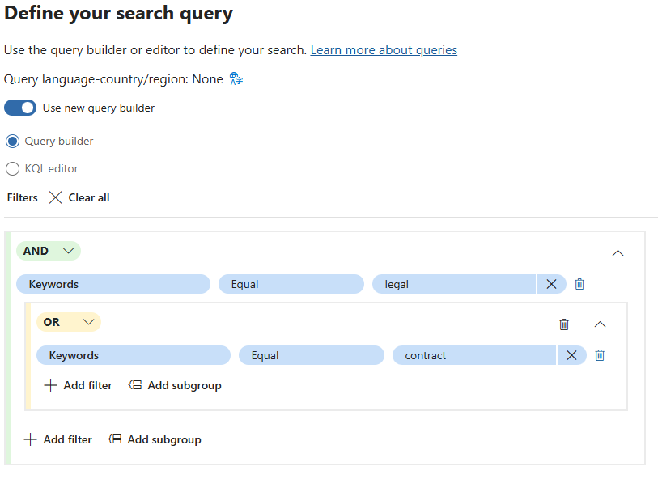
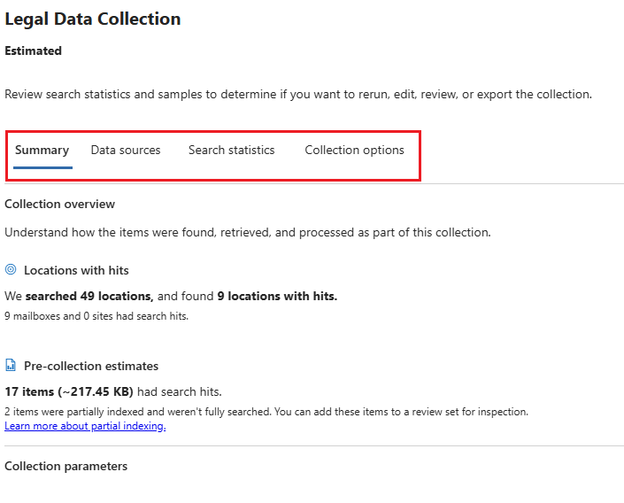

---
lab:
  task: Case investigation with eDiscovery (Premium)
  exercise: Exercise 3 - Case investigation with eDiscovery (Premium)
---

## Locatários do WWL – Termos de uso

Se você estiver recebendo um locatário como parte de uma entrega de treinamento com instrutor, observe que o locatário é disponibilizado com a finalidade de dar suporte aos laboratórios práticos no treinamento com instrutor.

Os locatários não devem ser compartilhados ou usados para fins fora dos laboratórios práticos. O locatário usado neste curso é um locatário de avaliação e não pode ser usado ou acessado após o fim da aula e não está qualificado para extensão.

Os locatários não podem ser convertidos em uma assinatura paga. Os locatários obtidos como parte deste curso permanecem a propriedade da Microsoft Corporation e reservamos o direito de obter acesso e a qualquer momento.

# Exercício 3 – Tarefas de qualificação

Sua tarefa é criar e gerenciar casos de Descoberta Eletrônica que atendam aos critérios de investigação:

- **Crie um novo caso de Descoberta Eletrônica**: configure um novo caso para iniciar sua investigação.
- **Adicione custodiantes ao caso**: inclua indivíduos relevantes que possam ter dados pertinentes.
- **Crie e execute uma estimativa de coleta**: analise o volume e a relevância dos dados para a investigação.
- **Revise e refine a estimativa de coleta**: verifique se a coleta atende aos seus critérios.
- **Confirmar a coleta em um conjunto de revisão**: prepare os dados para análise detalhada.
- **Exporte os resultados da pesquisa**: salve os dados coletados para fins adicionais de revisão e conformidade.

>**Observação**: este laboratório pressupõe acesso a um locatário do M365 E5 com dados a serem explorados para conduzir uma investigação. Você ainda podrá este exercício sem os dados, mas as coletas e os conjuntos de revisão não produzirão resultados.

## Tarefa 1 – Conceder permissões para Descoberta Eletrônica (Premium)

Para exportar arquivos, você precisa de permissões específicas devido ao acesso direto que esta opção concede aos arquivos do usuário.

1. No Microsoft Edge, navegue até o portal do Microsoft Purview, `https://purview.microsoft.com`, e faça logon.
1. Selecione o cartão **Configurações**.

   Se você não vir o cartão **Configurações**, selecione **Exibir todas as soluções** e selecione o cartão **Configurações** na seção **Núcleo**.

1. No painel de navegação à esquerda, expanda **Funções e escopos** e selecione **Grupos de funções**.
1. Na página **Grupos de funções para Soluções do Microsoft Purview**, selecione **Gerenciador de Descoberta Eletrônica**.
1. Na página de submenu **Gerenciador de Descoberta Eletrônica** à direita, selecione **Editar**.
1. Na página **Gerenciar o Administrador de Descoberta Eletrônica**, selecione **Escolher usuários**.
1. Na página de submenu **Escolher usuários** à direita, selecione o usuário que você usará para fazer este exercício interativo e clique em **Selecionar**.
1. De volta à página **Gerenciar Gerenciador de Descoberta Eletrônica**, selecione **Avançar**.
1. Na página **Gerenciar o Administrador de Descoberta Eletrônica**, selecione **Avançar**.
1. Na página **Revisar o grupo de funções e concluir**, clique em **Salvar** para adicionar seu usuário ao grupo de funções do Gerenciador de Descoberta Eletrônica.
1. Depois de adicionar os usuários , selecione **Concluído** na página **Você atualizou o grupo de funções**.
1. Selecione **Página Inicial** para navegar de volta para a home page do Portal do Microsoft Purview.

Você concedeu a permissão do Gerenciador de Descoberta Eletrônica.

## Tarefa 2 – Criar um caso de Descoberta Eletrônica (Premium)

Agora que você tem as permissões necessárias, pode criar um novo caso de Descoberta Eletrônica para iniciar sua investigação.

1. Você deve estar na home page do portal do Microsoft Purview.

   Se não estiver, no Microsoft Edge, navegue até o portal do Microsoft Purview, `https://purview.microsoft.com`, e faça logon.

1. Selecione **Exibir todas as soluções**.
1. Em **Risco e Conformidade** , selecione o cartão **Descoberta Eletrônica**.
1. No painel de navegação à esquerda, expanda **Casos Premium** e selecione **Casos**.
1. Na página **Descoberta Eletrônica (Premium),** selecione **+ Criar um caso**.
1. Na página de submenu **Nomear seu caso** à direita, insira:

   - **Nome**: `Legal Investigation 2024`
   - **Descrição**: `eDiscovery case for the 2024 legal investigation involving relevant emails and documents.`

1. Na página **Adicionar membros da equipe e definir configurações**, certifique-se de adicionar o usuário que conduzirá a investigação e clique em **Avançar**.
1. Na página **Revisar caso**, clique em **Enviar** e, em seguida, **Concluído**.

Você criou um novo caso de Descoberta Eletrônica chamado _Investigação Jurídica 2024_.

## Tarefa 3 – Adicionar custodiantes ao caso

Agora que o caso foi criado, você precisa adicionar custodiantes. Os custodiantes são indivíduos que podem possuir informações relevantes para a investigação.

1. Depois de criar o caso na tarefa anterior, você deve estar na guia **Visão geral** do caso **Investigação Jurídica 2024**.

   Se não estiver, no Microsoft Edge, navegue até o portal do Microsoft Purview, `https://purview.microsoft.com`, e faça logon. Selecione o cartão **Descoberta Eletrônica** na seção **Risco e Conformidade**. Selecione **Casos Premium** > **Casos** e selecione o caso **Investigação Jurídica 2024** recém-criado.

1. Selecione a guia **Fontes de dados** na navegação superior e, em seguida, selecione **Adicionar fonte de dados** > **Adicionar novos custodiantes**.
1. Na página de submenu **Novo custodiante**, em **Selecionar custodiante**, adicione custodiantes ao seu caso e clique em **Avançar**.
1. Na página **Configurações de espera**, verifique se os custodiantes adicionados na etapa anterior estão selecionados para colocar em espera.
1. Na página **Revisar custodiantes**, selecione **Enviar** e, em seguida, **Concluído** depois que os novos custodiantes forem criados.

Você adicionou custodiantes ao caso _Investigação Jurídica 2024_.

## Tarefa 4 – Criar e executar uma estimativa de coleta

Com os custodiantes adicionados, agora você pode executar uma estimativa de coleta para obter uma visão geral do volume e da relevância dos dados.

1. Depois de adicionar custodiantes ao caso na tarefa anterior, você ainda deve estar na guia **Fontes de dados** do caso **Investigação Jurídica 2024**.  

   Se não estiver, no Microsoft Edge, navegue até o portal do Microsoft Purview, `https://purview.microsoft.com`, e faça logon. Selecione o cartão **Descoberta Eletrônica** na seção **Risco e Conformidade**. Selecione **Casos Premium** > **Casos** e selecione o caso **Investigação Jurídica 2024** recém-criado.

1. Selecione a guia **Coletas** na navegação superior e selecione **+ Nova coleta**.
1. Na configuração **Nova coleta**, dê à coleta um **Nome e descrição**. Digite:

   - **Nome**: `Legal Data Collection`
   - **Descrição**: `Collecting emails and documents relevant to the 2024 legal investigation.`

1. Selecione **Avançar**.
1. Em **Escolher fontes de dados de custódia**, clique em **+ Selecionar custodiantes**.
1. Na página de submenu **Selecionar custodiantes** à direita, adicione os custodiantes que foram adicionados ao caso na tarefa anterior e selecione **Adicionar**.
1. De volta à página **Escolher fontes de dados de custódia**, selecione **Avançar**.
1. Em **Escolher fontes de dados não custodiais**, selecione **Avançar**.
1. Em **Locais adicionais**, defina o status como **Ativado** para estes locais:

   - Caixas de correio do Exchange
   - Pastas públicas do Exchange

1. Selecione **Avançar**.
1. Na página **Definir consulta de pesquisa**, use o construtor de consultas para criar uma pesquisa para localizar conteúdo relevante para o caso:

   - Use o operador **AND** para pesquisar **palavras-chave****iguais** a `legal`.
   - Selecione **Adicionar um subgrupo**.
   - Use o operador **OR** para pesquisar **palavras-chave****iguais** a `contract`.

    >

1. Selecione **Avançar**.
1. Na página **Revisar e criar coleta**, selecione **Enviar** e, em seguida, **Concluído** na página **Nova coleta criada**.
1. De volta à página **Coletas**, revise o andamento da estimativa de coleta. Use o botão **Atualizar** para atualizar a página e verificar o status da estimativa de coleta. Depois que o status da estimativa for atualizado para **Estimado** e o **Status da prévia** for atualizado para **Êxito**, a estimativa de coleta será concluída.

    >

    >**Dica**: quando a estimativa de coleta for concluída, sinta-se à vontade para tentar criar consultas diferentes ou usar o editor KQL para pesquisas mais avançadas. Para fazer isso, marque a caixa de seleção à esquerda da estimativa de coleta e selecione **Editar coleta**. A página **Definir consulta de pesquisa** abrirá. Você pode modificar a consulta e enviar uma nova estimativa de coleta para explorar como a consulta altera sua estimativa de coleta.

1. Selecione a **Coleta de dados jurídicos** e explore a estimativa de coleta.

   - **Guia Resumo**: fornece uma visão geral das estatísticas da coleta, incluindo itens recuperados, locais com ocorrências e tipos de arquivo.
   - **Guia Fontes de dados**: exibe informações sobre fontes de dados custodiais e não custodiais incluídas na coleta.
   - **Guia Estatísticas de pesquisa**: mostra estatísticas detalhadas da última estimativa de coleta, incluindo o número de itens e o volume de dados.
   - **Guia Opções de coleta**: lista e explica as diferentes opções disponíveis ao configurar uma coleta, como incluir anexos na nuvem e tópicos de conversa.

    >

Você criou e revisou uma coleta chamada _Coleta de Dados Jurídicos_.

## Tarefa 5 – Confirmar a coleta em um conjunto de revisão

Quando a coleta estiver satisfatória, confirme-a em um conjunto de revisão para análise detalhada.

1. Depois de criar a estimativa de coleta na tarefa anterior, você ainda deve estar na guia **Coletas** do caso **Investigação Jurídica 2024**.  

   Se não estiver, no Microsoft Edge, navegue até o portal do Microsoft Purview, `https://purview.microsoft.com`, e faça logon. Selecione o cartão **Descoberta Eletrônica** na seção **Risco e Conformidade**. Selecione a guia **Casos Premium** > **Casos** > **Investigação Jurídica 2024** > **Coletas**.

1. Selecione a coleção **Coleta de dados jurídicos**.
1. Na página de submenu **Coleta de dados jurídicos** à direita, selecione **Confirmar coleta**.
1. Na página **Confirmar itens em um conjunto de revisão**, verifique se a opção **Adicionar a um novo conjunto de revisão ** está selecionada e nomeie-a `Legal Case Review`.
1. Deixe os outros padrões selecionados e selecione **Confirmar** para confirmar a coleção em um conjunto de revisão.

Você confirmou a coleta em um conjunto de revisão.

## Tarefa 6 – Explorar o conjunto de revisão

1. Depois de confirmar a coleta em um conjunto de revisão na tarefa anterior, você ainda deve estar na guia **Coleta** do caso **Investigação Jurídica 2024**.

   Se não estiver, no Microsoft Edge, navegue até o portal do Microsoft Purview, `https://purview.microsoft.com`, e faça logon. Selecione o cartão **Descoberta Eletrônica** na seção **Risco e Conformidade**. Select **Casos Premium** > **Casos** > **Investigação Jurídica 2024**.

1. Selecione a guia **Conjuntos de revisão** na navegação superior e, em seguida, selecione o conjunto de revisão de **Revisão de Casos Jurídicos** recém-criado.
1. Na página de submenu **Revisão de casos jurídicos** à direita, clique em **Abrir conjunto de revisões** na parte inferior da página.
1. Explore o que você pode fazer com os itens do seu conjunto de revisão:

   1. **Filtros**: permite aplicar condições para restringir os itens exibidos no conjunto de revisão.
   1. **Rótulo**: permite rotular documentos com rótulos específicos para melhor organização e identificação.
   1. **Grupo**: permite organizar o conteúdo do conjunto de revisão por itens relacionados, como famílias ou conversas.
   1. **Exibir fonte**: fornece uma visualização avançada do documento selecionado, exibindo-o em seu formato original.
   1. **Exibir texto sem formatação**: mostra o texto extraído de um documento, ignorando imagens e formatação incorporadas.
   1. **Anotar**: permite que os usuários apliquem marcações, redações e outras anotações no documento.
   1. **Exibir metadados**: exibe vários metadados associados ao documento selecionado para obter informações detalhadas.

    >

1. Depois de explorar o conjunto de avaliações, você pode exportar itens para análise posterior.

Você abriu e revisou seu conjunto de revisão.

## Tarefa 7 – Exporte os resultados da pesquisa

Para salvar seu trabalho e permitir uma análise mais aprofundada, você exportará os resultados da pesquisa.

1. Você ainda deve estar no conjunto de revisão **Revisão de Caso Jurídico** na Descoberta Eletrônica (Premium).

   Se não estiver, no Microsoft Edge, navegue até o portal do Microsoft Purview, `https://purview.microsoft.com`, e faça logon. Selecione o cartão **Descoberta Eletrônica** na seção **Risco e Conformidade**. Selecione a guia **Casos Premium** > **Casos** > **Investigação Jurídica 2024** > **Conjunto de revisão** > **Revisão do caso jurídico**.

1. Marque a caixa de seleção ao lado dos itens que deseja exportar para análise posterior.
1. Selecione a lista suspensa em **Ações** > **Exportar**.

    >

1. Na página de submenu **Opções de exportação** à direita, insira:

   - **Nome da exportação**: `LegalCaseExport_July2024`
   - **Descrição**: `Export of relevant emails and documents for the July 2024 legal case investigation.`
   - **Exportar estes documentos**: somente documentos selecionados
   - **Expandir seleção**: nenhum
   - **Opções de saída**: estrutura de diretório condensada

1. Clique no botão **Exportar** na parte inferior da página de submenu.

    >

1. Você receberá uma notificação informando que **Um trabalho foi criado** para exportar seu conjunto de revisão. Selecione **OK** nesta notificação.
1. Para acessar o conjunto de revisão exportado, expanda **Casos Premium** no painel de navegação à esquerda e selecione **Casos**. Selecione o caso **Investigação Jurídica 2024** e, em seguida, a guia **Exportações** na navegação superior.
1. Selecione o **LegalCaseExport_July2024**.
1. Na página de submenu **LegalCaseExport_July2024** à direita, marque a caixa de seleção ao lado à esquerda de cada arquivo exportado e selecione **Baixar**. Isso fará o download de um resumo .csv e um arquivo zip dos itens exportados.

    >**Dica**: talvez seja necessário desativar o bloqueador de pop-ups para baixar os arquivos exportados.

Você exportou os resultados da pesquisa para revisão.
